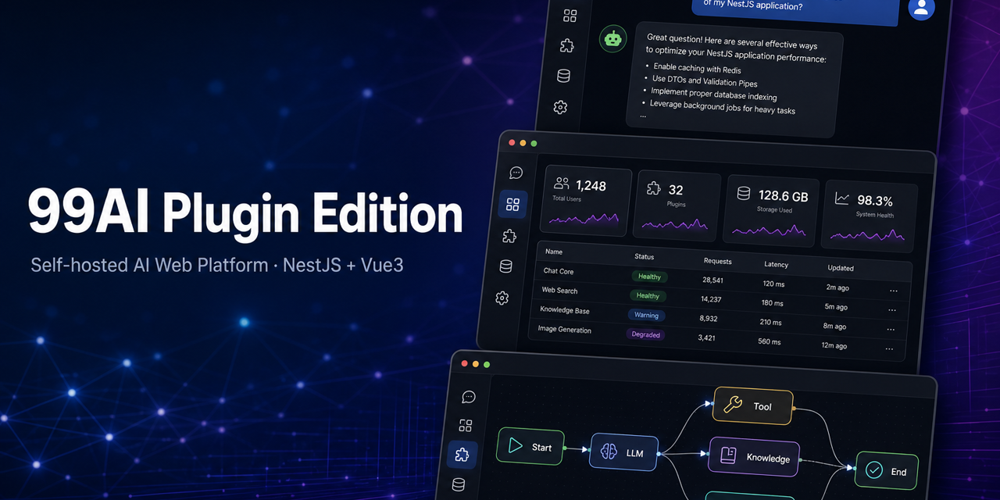
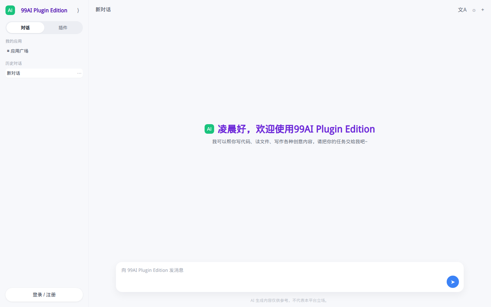
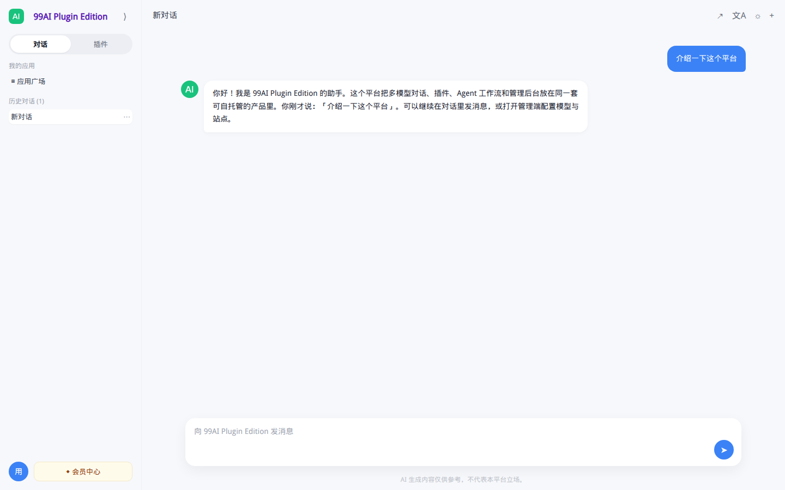
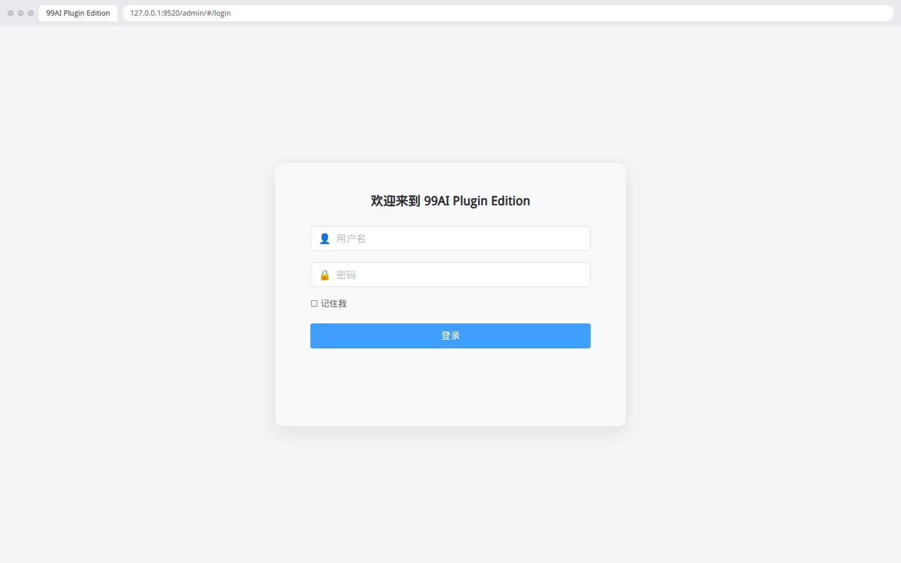
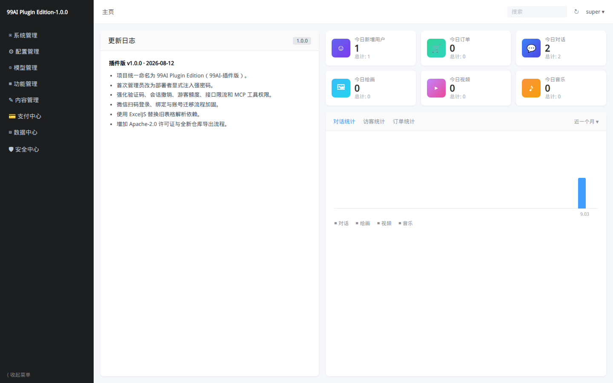
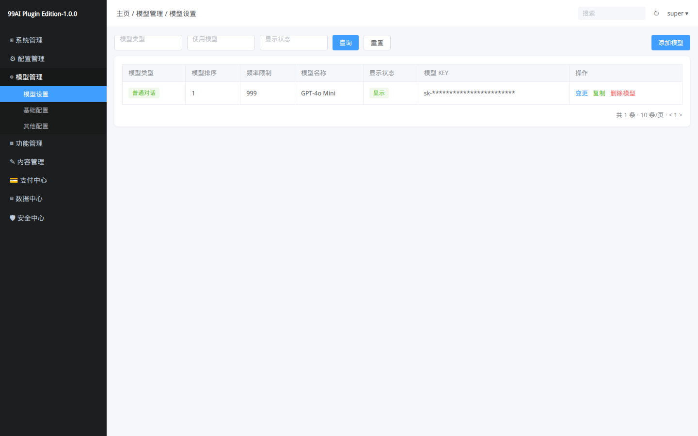
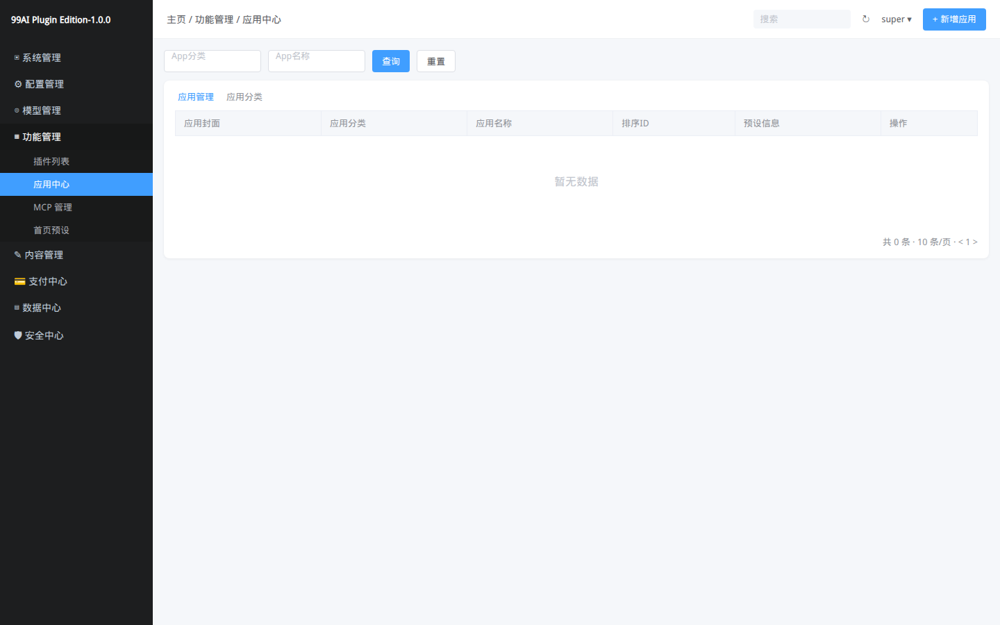

# 99AI Plugin Edition

<div align="center">

**可自托管的一站式 AI Web 平台 · 对话、插件、Agent 与运营后台都在仓库里。**

[](LICENSE)
[](https://nodejs.org/)
[](https://docs.docker.com/compose/)
[](https://github.com/vastxie/99AI-plugin-edition/stargazers)

作者与维护者：[vastxie](https://github.com/vastxie)

如果这个项目对你有帮助，欢迎点亮右上角的 **Star ⭐**，也欢迎一起维护。

<br />



</div>

## 这是什么

99AI Plugin Edition（99AI 插件版）是一套**完整未编译**的开源 AI 服务平台：用户打开就能聊天，管理员登录就能配模型、管应用、看数据。仓库里同时包含用户端、管理端和服务端，适合私有化部署和二次开发。

部署需要 MySQL、Redis，以及至少一个 **OpenAI 兼容**模型服务。整合后默认监听 `9520`：用户端在 `/`，管理端在 `/admin`。

## 适合谁

- **想自己搭一套 AI 站点的人**：Docker 或一键打包都能跑起来，先聊天、再慢慢配运营。
- **需要后台而不是只有 Chat UI 的团队**：用户、额度、套餐、登录方式和站点外观都可以在管理端改。
- **要改源码的开发者**：NestJS + Vue 3 全栈源码都在仓库里，插件、Agent、MCP 都有明确模块入口。

如果你只需要一个最小聊天窗，它可能偏重；如果你希望「对话 + 插件 + 后台」在同一套产品里，它就是为此准备的。

## 界面预览

下面是本地部署后的实机界面，方便你先看清楚产品长什么样。

### 用户端

对话首页：问候、说明和输入框，侧边栏可在「对话」与「插件」之间切换，也能进入应用广场。



<p align="center"><sub>对话首页（本地实机截图）</sub></p>

发一条消息后的对话流：用户气泡、助手回复、底部输入区都在同一屏里。



<p align="center"><sub>多轮对话界面（本地实机截图）</sub></p>

### 管理端

管理端独立登录，默认地址为 `http://服务器:9520/admin`。



<p align="center"><sub>管理端登录（本地实机截图）</sub></p>

登录后是站点总览：今日用户、对话等统计，以及版本更新说明。



<p align="center"><sub>管理端首页与数据概览（本地实机截图）</sub></p>

在「模型管理」里接入 OpenAI 兼容模型，控制展示、排序和密钥。



<p align="center"><sub>模型列表与配置（本地实机截图）</sub></p>

「应用中心」用来管理应用封面、分类和预设，同一分组下还能看到插件列表与 MCP 管理。



<p align="center"><sub>应用中心（本地实机截图）</sub></p>

## 核心能力

- **多模型对话**：上下文管理、流式回复；模型 Key 在管理端填写，不写进源码。
- **应用与插件**：应用广场、应用预设、插件，以及 Agent 工作流编排。
- **MCP 工具**：可接入 MCP 工具并做权限控制；默认最小权限，按角色放行。
- **多模态扩展**：文件分析、联网搜索，以及图片、视频、音乐、PPT 等能力（按需开启对应服务）。
- **运营后台**：用户、额度、套餐/卡密、订单支付、登录方式（邮箱 / 短信 / 微信等）和站点外观。
- **一体部署**：用户端与管理端由同一服务托管，Docker Compose 或整合包均可。

全新数据库若还没配可用模型，用户端会提示管理员先去后台完成模型配置，而不会默默建出空会话。

## 工程组成

| 目录 | 技术栈 | 用途 |
| --- | --- | --- |
| [`service/`](service/README.md) | NestJS、TypeORM、MySQL、Redis | API、认证、聊天、插件、Agent、MCP、上传和支付 |
| [`chat/`](chat/README.md) | Vue 3、Pinia、Tailwind CSS | 用户聊天端 |
| [`admin/`](admin/README.md) | Vue 3、Element Plus、UnoCSS | 管理后台 |

更细的生产加固、HTTPS、备份和上线验收见 [部署与首次配置](docs/DEPLOYMENT_AND_CONFIGURATION.md)。

## 快速开始

两条路，按你的环境选一条即可。

### 方式一：Docker Compose（推荐）

适合希望 MySQL、Redis 和应用一起拉起的部署。需要 Docker Engine 24+ 或 Docker Desktop、Compose v2，建议至少 4 核 / 8 GB 内存 / 10 GB 磁盘。

```bash
git clone https://github.com/vastxie/99AI-plugin-edition.git
cd 99AI-plugin-edition/service
cp .env.example .env
```

编辑 `.env`，至少设置（`INITIAL_ADMIN_PASSWORD` 示例值为空，占位符会被拒绝）：

```dotenv
MYSQL_ROOT_PASSWORD=<独立的强随机密码>
DB_PASS=<独立的强随机密码>
REDIS_PASSWORD=<独立的强随机密码>
INITIAL_ADMIN_USERNAME=super
INITIAL_ADMIN_PASSWORD=<至少 12 位的独立强密码>
INITIAL_ADMIN_EMAIL=<管理员邮箱>
CORS_ORIGINS=https://ai.example.com
DB_SYNC=true
```

首次使用全新数据库时构建并启动：

```bash
docker compose up --build -d
docker compose ps
docker compose logs --tail=200 service
```

确认首次建表完成后，**立即**将 `DB_SYNC` 改回 `false`，再执行：

```bash
docker compose up -d --force-recreate service
```

然后打开：

- 用户端：`http://服务器地址:9520/`
- 管理端：`http://服务器地址:9520/admin`
- 健康检查：`GET /api/health`

### 方式二：一键整合打包

面向已经有 MySQL / Redis、希望先在本机构建再拷到服务器的场景。仓库根目录的脚本会安装锁定依赖、构建三端，并输出到独立目录：

```bash
git clone https://github.com/vastxie/99AI-plugin-edition.git
cd 99AI-plugin-edition
./build.sh
```

构建完成后，整合目录位于：

```text
99AIPluginQuickDeploy/
```

目录里已包含服务端 `dist/`、用户端与管理端静态文件、生产依赖清单、环境变量模板和启动脚本。**生成目录内的 `README.md` 只描述该扁平布局的启动方式**；源码仓库的 `cd service` / `docker compose` 路径不适用于此目录。将该目录复制到部署服务器后执行：

```bash
cp .env.example .env
# 编辑 .env
pnpm install --prod --frozen-lockfile
pnpm start
```

构建环境需要 Node.js 20–24 和 pnpm 10.33.2。`99AIPluginQuickDeploy/` 不会进入 Git 或 Docker 构建上下文；再次执行脚本时，只有三端全部构建成功才会更新该目录。整合包的目录说明见 [docs/QUICK_DEPLOY.md](docs/QUICK_DEPLOY.md)。

## 首次配置

用 `.env` 里的超级管理员登录管理端后，建议按这个顺序走一遍：

1. **系统管理 / 基础配置**：站点名称、正式站点 URL、Logo、语言和主题。
2. **模型管理 / 基础设置**：模型服务 Base URL、Key 和全局模型。
3. **模型管理 / 模型列表**：添加并启用至少一个模型，API 模型名必须与供应商目录一致。
4. **用户管理 / 用户配置**：注册、签到、访客额度和登录方式。
5. **存储与外部服务**：配置文件存储；邮件、短信、微信、支付等按需开启，并逐项实测。

模型服务 Key 由部署者在管理端填写。支付、邮件、短信、微信回调在正式对外前，请用真实配置各验证一次。

## 本地开发

要求 Node.js 20–24（推荐 22）和 pnpm 10.33.2，并准备可连接的 MySQL 与 Redis：

```bash
git clone https://github.com/vastxie/99AI-plugin-edition.git
cd 99AI-plugin-edition
corepack enable
corepack prepare pnpm@10.33.2 --activate
```

分别安装依赖并验证：

```bash
cd service && pnpm install --frozen-lockfile && pnpm test -- --runInBand && pnpm build
cd ../chat && pnpm install --frozen-lockfile && pnpm type-check && pnpm build
cd ../admin && pnpm install --frozen-lockfile && pnpm lint && pnpm build
```

三个工程都可在各自目录运行 `pnpm dev`。用户端开发服务器默认 `9002`，管理端默认 `9000`，接口指向 `http://127.0.0.1:9520/api`。生产环境请使用构建产物或 Docker Compose，不要直接暴露开发服务器。

## 参与贡献

欢迎通过 Issues 和 Pull Requests 参与，也欢迎长期共同维护。

1. 先搜索现有 Issue；大型功能请先讨论目标、接口和兼容策略。
2. Fork 仓库，从最新 `main` 拉出范围清晰的功能分支。
3. 按改动范围运行上面的测试、类型检查、Lint 和构建。
4. PR 里写清改动目的、验证结果、兼容性变化，以及尚未覆盖的风险。

请勿提交 `.env`、Key、数据库、日志、上传文件或个人信息。安全漏洞请按 [SECURITY.md](SECURITY.md) 私密提交，不要在公开 Issue 里发布密钥、个人数据或可直接利用的复现细节。

除非另有明确声明，提交到本项目的贡献按 Apache License 2.0 第 5 节处理。

仓库中的 `scripts/export-open-source-snapshot.sh` 是维护者用来生成干净源码快照的发布工具（仅支持 macOS，依赖 bsdtar 与 xattr），日常部署与贡献不必使用。

## 交流群

微信扫一扫，备注「99」进群交流。作者不提供私聊技术咨询，进群后请先阅读群公告。


## 部署安全提示

- 不要提交或公开 `.env`、数据库、日志、上传文件及任何服务 Key。
- 生产环境应启用 HTTPS、限制 `CORS_ORIGINS`、使用独立强密码，并保持 `DB_SYNC=false`。
- MCP 工具默认保持最小权限；支付、邮件、短信和微信回调必须用正式配置实测。
- 本地存储的 `/file` 当前为匿名静态访问，不应存放敏感、私密或受监管文件；公网使用前应增加鉴权或签名 URL。

## 免责声明

- 本项目按“现状”提供，不承诺服务持续可用，也不保证 AI 生成内容的准确性、完整性或适用于特定目的。AI 输出不应直接作为医疗、法律、金融等专业决策依据。
- 使用者应确保拥有所使用的模型、接口、数据和内容的合法授权，并遵守所在地法律法规及上游服务条款。禁止将本项目用于违法活动或侵害他人知识产权、隐私权等合法权益。
- 在中国大陆面向公众提供生成式人工智能服务的运营者，应按实际业务遵守[《生成式人工智能服务管理暂行办法》](https://www.cac.gov.cn/2023-07/13/c_1690898327029107.htm)、[《人工智能生成合成内容标识办法》](https://www.cac.gov.cn/2025-03/14/c_1743654685899683.htm)及其他适用规定，依法履行内容标识、安全评估、算法备案或许可等义务；内部研发或非公众服务是否适用，应根据实际场景判断。
- 部署、运营、二次开发及 AI 生成内容产生的风险与责任由使用者承担。本说明不构成法律意见；正式运营前请结合业务所在地和服务方式进行专业合规评估。

## 开源许可

Copyright 2026 vastxie

本项目由 `vastxie` 以 [Apache License 2.0](LICENSE) 发布。
